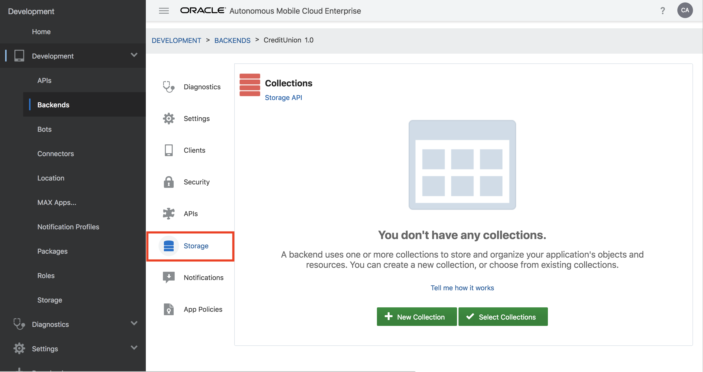
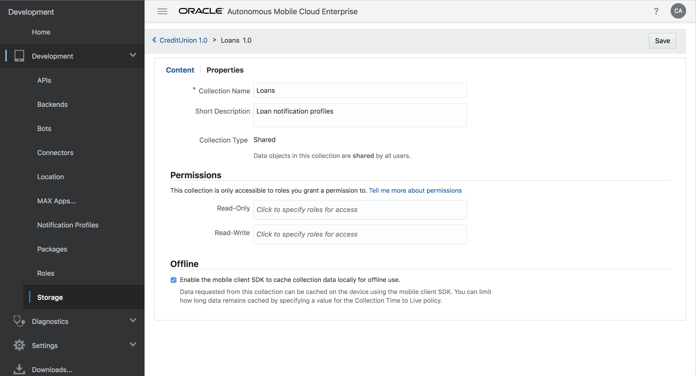
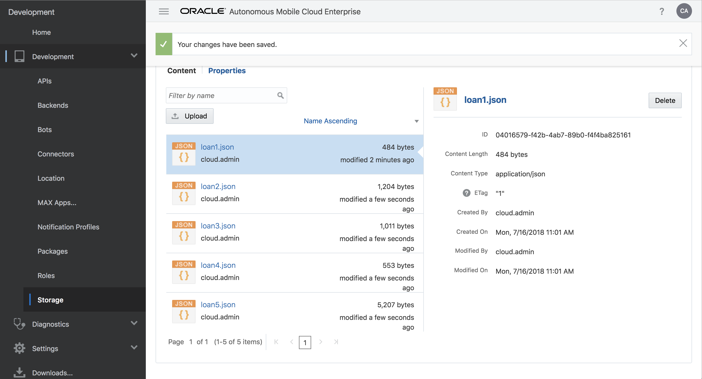
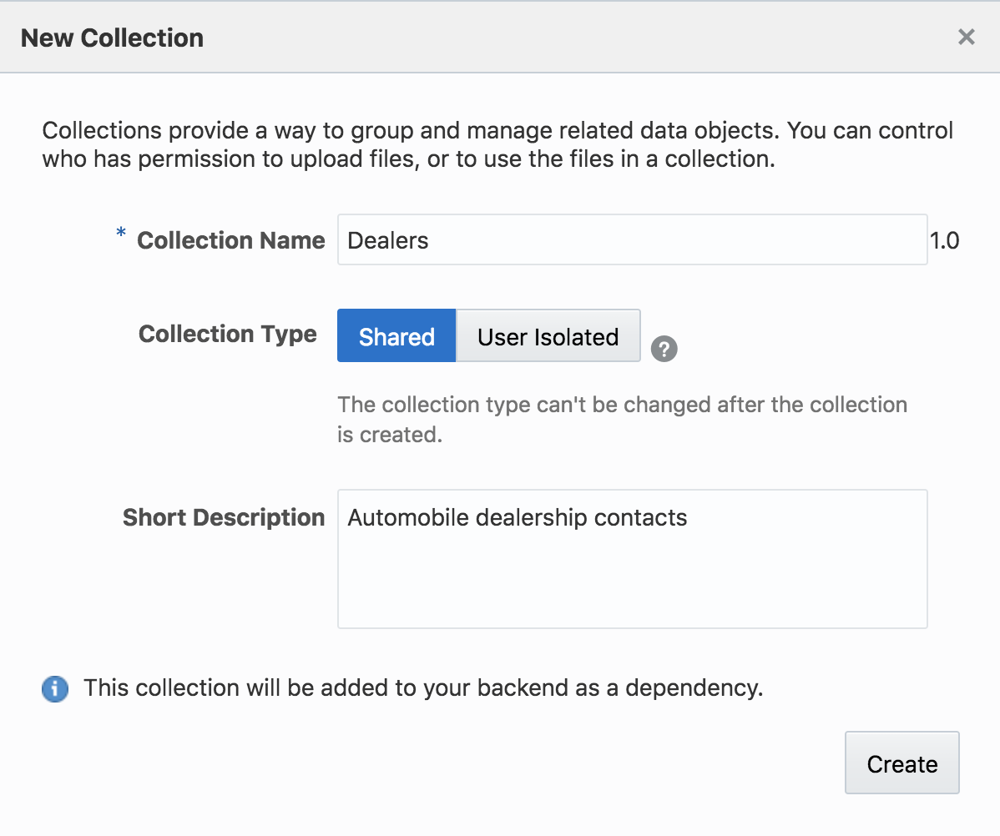
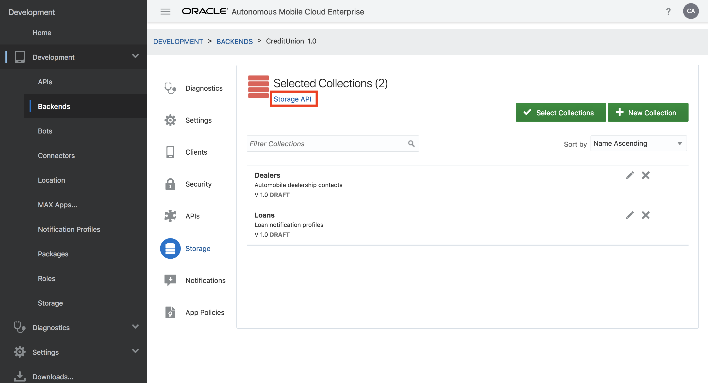
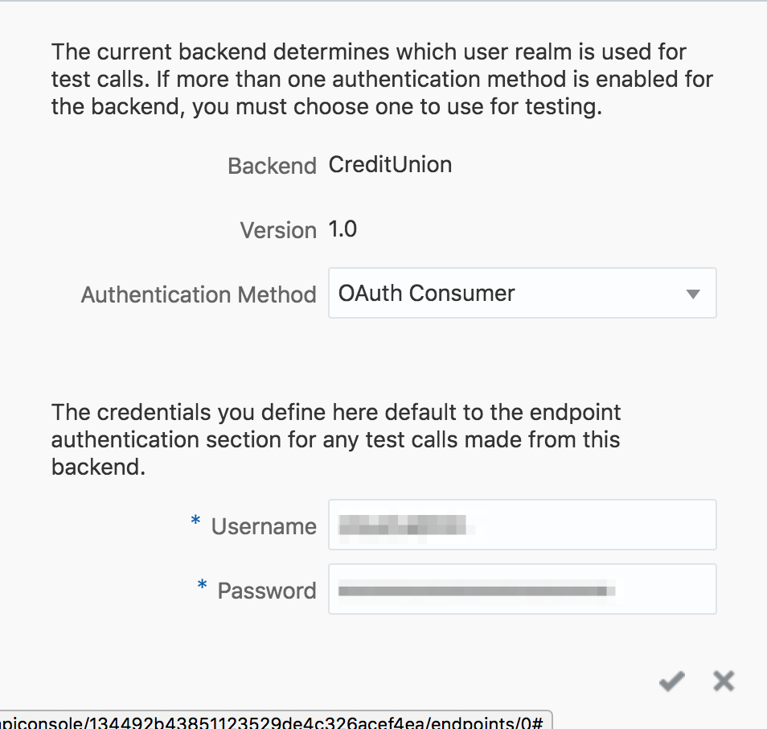
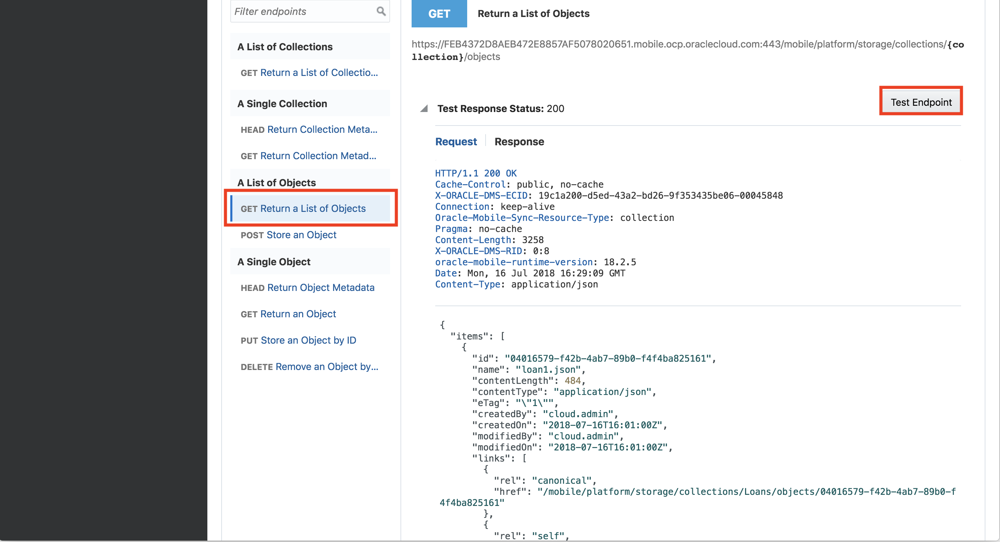

# Creation and Configuration of Storage Microservices

  
Update: March 31, 2017

## Introduction

This is the second of several labs that are part of the Oracle Public Cloud **AMCe Application Development workshop.** This workshop will walk you through the Software Development Lifecycle (SDLC) for a dual-channel application (web + mobile) built using Oracle's Autonomous Mobile Cloud Enterprise (AMCe) as a complete backend solution.

In the first lab (100), you created a new Mobile Backend (MBE) project in your Autonomous Mobile Cloud Enterprise (AMCe) environment. You also configured your environment by setting our policies to allow for CORS access, added Groups and Roles for our MBE users, and enabled access to our IDCS Admin API. In this lab, we will go ahead and actually create the Loans and Dealers storage collection in our AMCe environment, upload our initial data objects, and use built-in, Storage REST API testing service to access our loan data objects.

**Please direct comments to: [Nolan Corcoran](nolan.corcoran@oracle.com)**

## Objectives
- Create & Configure New Storage Collections
- Upload Data Objects to Storage Collections
- Test REST API Access to Storage Collection

## Required Artifacts
- The following lab requires an Oracle Public Cloud account that will be supplied by your instructor.

# Create Storage Collections

## Create Loans Storage Collection

### **STEP 1**: Login to your AMCe environment using IDCS
- From any browser, go to the URL of your AMCe environment

- If you are not already logged in, you will be redirected to the IDCS login page. There, enter your User Name and Password and click **Sign In**.:

  

- If you successfully log in, you will be redirected to the AMCe landing page.

  

### **Step 2**: Create Initial *Loans* Storage Collection

In order to create our object storage microservice and have it automatically be associated with our MBE, we will create the storage collections with the storage section of our CreditUnion MBE page.

- To navigate to our CreditUnion MBE, first **click** on the hamburger menu (  ) to pull up the sidebar navigation menu. Then, click on the **Development** dropdown and click on the **Backends** option. This will take us to a list of backends we have previously created. From there, click on the backend named **CreditUnion**. Finally, to go into our MBE, click the **Open** button.

  

- Now that we are in our CreditUnion MBE, click **Storage** in the inner menu on the left side to navigate to the associated storage collections.

  

- Click **+ New Collection** and fill out the creation form as follows:

  **Collection Name:** `Loans`

  **Collection Type:** `Shared`

  **Short Description:** `Loan notification profiles`

  

- Click **Create** and you will be navigated to the **Properties** tab of the Loans Collection page.

  

### **Step 3**: Configure and Populate Loans Collection

- Under **Permissions**, give **Read-Write** access to both the **LoanProcessors** and **Dealers** roles.

  

- Click **Save** and then navigate to the **Content** tab. Here, click the **Upload Files** button and upload the `loan1.json` file from the workshop code you downloaded in the pre-workshop lab in the `env/data/loans/` directory. Make a note of the **ID** given to this object as we will need it in the following lab.

  

- Do the same for the rest of the loan files in the `env/data/loans/` directory and then click **Save** once more.

  

## Create Dealers Storage Collection

### **STEP 4**: Create Initial Dealers Storage Collection

- From here, navigate back to the CreditUnion MBE page by clicking the **CreditUnion 1.0** breadcrumb link.

  

- Click **+ New Collection** and fill out the creation form as follows and then click **Create**:

  **Collection Name:** `Dealers`

  **Collection Type:** `Shared`

  **Short Description:** `Automobile dealership contacts`

  

### **Step 5**: Configure and Populate Loans Collection

- Under **Permissions**, give **Read-Write** access to both the **LoanProcessors** and **Dealers** roles.

  

- Click **Save** and then navigate to the **Content** tab. Here, click the **Upload Files** button and upload the `dealer1.json` file from the workshop code you downloaded in the pre-workshop lab in the `env/data/dealers/` directory. Make a note of the **ID** given to this object as we will need it in the following lab. Do the same for the rest of the dealer files in the `env/data/dealers/` directory and then click **Save** once more. You do not need to copy the rest of the object **ID**s.

# Test Storage REST API

## Test Access to Loans Collection

### **STEP 6**: Test `GET Return a List of Objects` Endpoint

- Navigate back to the CreditUnion MBE page once more by clicking the **CreditUnion 1.0** breadcrumb. From here, in the **Storage** section, click the **Storage API** link at the top of the page to navigate to the Storage REST API Test UI.

  

- Click **Default Test Credentials**, select **OAuth Consumer** for the Authentication Method, fill in your **Username** + **Password**, and click the checkmark to save your settings.

  

- Test that you can successfully access your storage collections by first clicking the **GET Return a List of Objects** request option. For the **collection** parameter, type **Loans** and then click **Test Endpoint** at the bottom of the page. If successful, you should receive a **Test Response Status: 200** message followed by the response body.

  

- You are now ready to move to the next lab.