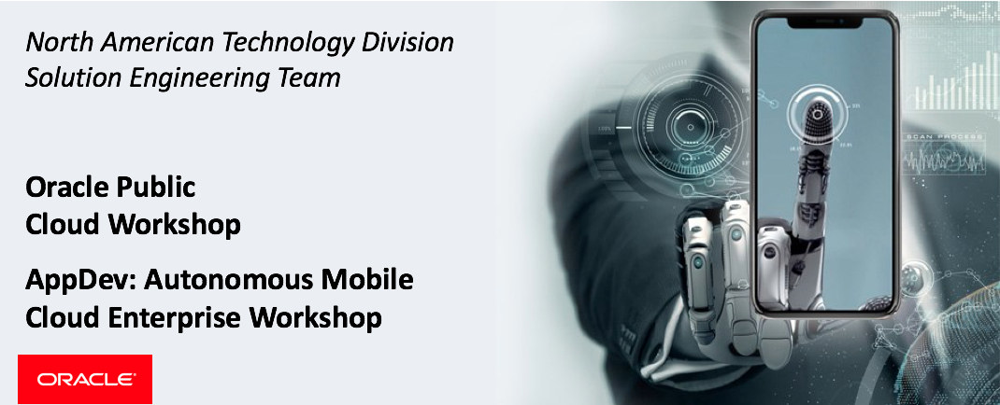
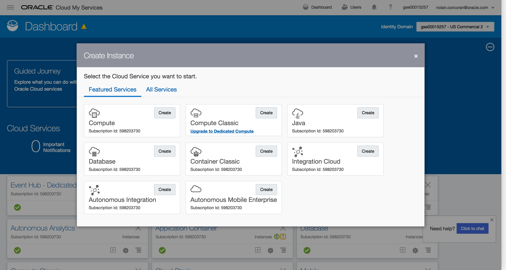
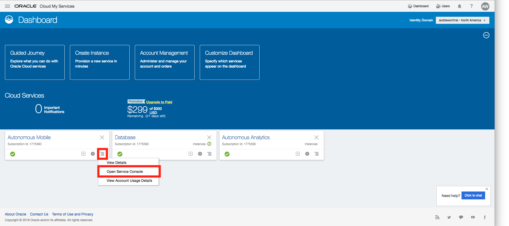
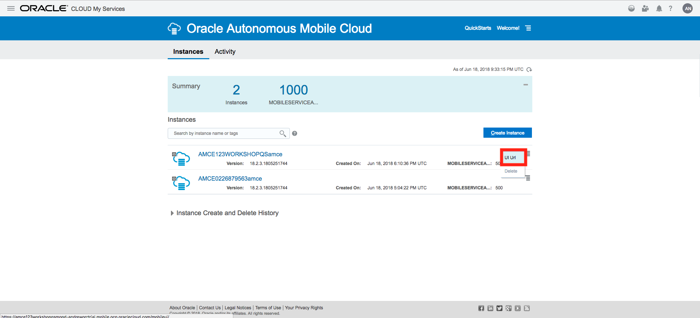

# Trial Account User Guide


Updated: April 17, 2018

## Workshop Introduction

This is the Oracle Public Cloud **AMCe Application Development workshop** which will walk you through the Software Development Lifecycle (SDLC) for a dual-channel application (web + mobile) built using Oracle's **Autonomous Mobile Cloud Enterprise** (AMCe) as a complete backend solution.

During this workshop you will be building a "sideband" notification channel as a solution for a hypothetical credit union. This channel will facilitate communication regarding loan application profiles between a credit union's loan processor ("admin" web app) and a contact at an automobile dealership ("client" mobile app). First, you will create the initial AMCe mobile backend project which we will be used by both our mobile and web applications. You'll then actually create the two applications and implement the backend microservices they rely upon. These will include custom APIs, object storage, user registration/authentication, client/app registration, device registration, and push notifications.

By completing the different components of this workshop, you will get in depth exposure to Oracle **Autonomous Mobile Cloud Enterprise** (AMCe), including its integrated, backend cloud services. Additionally, by creating the "admin" app, you will gain experience using Oracle **Application Container Cloud Service** to deploy web applications. Lastly, throughout the development process of this workshop, you will gain valuable experience using a combination of popular open-source technologies together with proprietary tools to develop enterprise-grade, full-stack applications.

- You can see a list of Lab Guides by clicking on the **Menu Icon**

  

- To log issues and view the Lab Guide source, go to the [github oracle](https://github.com/oracle/learning-library/issues/new) repository.

- Visit the [Workshop Interactive Labguide](https://launch.oracle.com/?microservices-devops) for a visual overview of the workshop content.

- All setup steps and lab replays have been posted on [youtube](https://www.youtube.com/playlist?list=PLPIzp-E1msrZhDmRUnNBSYY6LJ2yWh3Ro). You can **watch the videos** to gain an overview of the workshop and what's required to successfully complete the labs.

# Workshop Prerequisites

## _Acquire an Oracle Cloud Trial Account_

### **Step 1**: Getting your Trial Account

- Click on this URL [cloud.oracle.com/tryit](http://cloud.oracle.com/tryit&intcmp=DeveloperInnovation-HOL-11NOV17), and complete all the required steps to get your free Oracle Cloud Trial Account.
- You must wait to receive our account before continuing to the "**Configure Oracle Cloud Identity Information**" Section.

## _Configure Oracle Cloud Platform Environment_

### **Step 2**: Record information from the welcome email and login

- During the provisioning of your account, you will receive two welcome email message. ***Note: You must wait for the 2nd email shown below***, as this email signals that your account is fully provisioned. If the second email does not appear within 30 minutes, please check your Junk or Promotions email folders (based on your email provider).


- For later use during the workshop labs, **record the following fields**, some of which you'll find in the email. This information will be ***used multiple times*** during the workshops Labs, so we recommend that you **copy the following list to a text document**, and then populate the fields as they are collected from the **Welcome Email** documented above.

```
Username:
Temporary Password:

Cloud Account Name:
Cloud Account Password:

```

- ***(1)*** **Username**: With a trial account, this should be your email address.
- ***(2)*** **Temporary Password**: The first time you login, you will use this temporary password.
- ***(3)*** **Cloud Account Name**: This name will be used when you login.
- **Cloud Account Password**: Once you reset your temporary password, record your new password.

### **Step 3**: Log into your Cloud Account

- Click on the link ***(4)*** **Get Started with Oracle Cloud** link provided in the email.

- Follow the instructions to **set your password**, and then record in your notes the new password for this **Cloud Account Password** field.

- You are now have viewing the dashboard used to access all the Cloud Services managed by the Oracle Identity Cloud Services.

- Click on the **Customize Dashboard** box to add the some select services to the Dashboard.

  

- Click on **Show** for the **Application Container** and **Autonomous Mobile Enterprise** services. Then click the **X** in the top right corner to close the dialog.

  


### **Step 4**: Create Autonomous Mobile Cloud Enterprise Instance

Now that we have the dashboard we want, let's go ahead and create our **AMCe** instance using the **QuickStart** instance creation engine.

- Click on **Create Instance** on the main dashboard page.

  

- Under **Autonomous Mobile Enterprise**, click the **Create** button.

  

- For **Instance Name**, either keep the auto-generated name or input your own instance name and then click **Create**.

  

### **Step 5**: Access AMCe Instance

- On the main dashboard, click **Autonomous Mobile Enterprise** and then click **Open Service Console** in the top right corner of the page. Here we see our successfully created **AMCe** instance.

  

- **Click** the hamburger menu icon to the right of our instance, **right** click **Go to Instance Home**, select **Copy Link Location**, and lastly save this copied URL for later.

  

## Install Application Software

### **Step 6**: Download/Install Xcode

- Open the Mac **App Store** app and search for `Xcode`. Under the `Xcode` app, click **GET** to begin installing the application.

  

### **Step 7**: Download/Install Postman

- In a browser, go to the [downloads page](https://www.getpostman.com/apps) of the Postman website and click **Download** under your operating system. Unzip the application file and move it to your `Applications` directory.

## Install CLI Tools/Software

### **Step 8**: Install XCode Command Line Tools

- First, check if the full Xcode package is already installed. In your terminal, enter the following shell command:

  `xcode-select -p`

  If you see:

  `/Applications/Xcode.app/Contents/Developer`

  the full Xcode package is already installed and you can move on to the next step.

- If you do not have the package already installed, enter the command:

  `xcode-select --install`

### **Step 9**: Install Homebrew

Homebrew is a software package management system that simplifies the installation of software on the `macOS` operating system. We will be using it to install key development tools that we'll need for this workshop.

- In your terminal, enter the following command:

  `/usr/bin/ruby -e "$(curl -fsSL https://raw.githubusercontent.com/Homebrew/install/master/install)"`

### **Step 10**: Install Git, Node, and Watchman

- In your terminal, enter the following command:

  `brew install git node watchman`

### **Step 11**: Install React Native CLI + Create React App

- In your terminal, enter the following command:

  `npm install -g react-native-cli && npm install -g create-react-app`

### **Step 12**: Download/Install AMCe CLI Tools

Oracle **Autonomous Mobile Cloud Enterprise** (AMCe) provides a set of custom code test tools which we will use in the following labs to test, debug, package, and deploy our custom API implementations from the command line.

- On the [AMCe Downloads page](http://www.oracle.com/technetwork/topics/cloud/downloads/amce-downloads-4478270.html), click the **Accept License Agreement** radio button and then download the `amce-tools-v1x.x.x.x` file at the bottom of the page under the **Tools** section.

  

- On your machine, open a terminal window, and change directories to the `omce-tools` directory that you just installed and run the command: `npm install -g`

- To ensure the tools were installed correctly, run `omce-test --version`. It should return a version number of the form `1x.x.x`.

### **Step 13**: Download Workshop Code

- To download the code we will be using in this workshop, we need to clone the code repository. In your terminal, find an appropriate directory for your project and enter the following command:

  `git clone https://github.com/ndc466/amce-appdev-workshop-code.git`

- Type `cd amce-appdev-workshop-code` and then `ls` and you should see the following project structure:

```
README.md
admin/ - code for the admin web application
api/ - implementation code for the AMCe Custom API
client/ - code for the client mobile application
env/ - environment data and configuration files
```

### **Step 14**: Acquire Apple IDs + Certificates (ignore)

- In the following labs, you will need the Oracle Team App ID and the associated APNS Certificate. Once you have that `.cer` file, use `Keychain Access` to export this certificate file to a `.p12` file.

- You are now ready to move to the next lab.